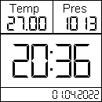

# About

Meteo station is an experimental weather measuring station built with ESP32.

It was developed using PaltformIO with Visual Studio Code.

In [this document](./doc/README.md) you'll find the electronic details to assemble this project.

# Features

Meteo station uses 2 sensors (DHT11 and BMP180) to measure temperature, atmospheric pressure and humidity.

It also connects to an MQTT server to publish those masures to different topics.

Topics list:
- `topic-meteo-temp`: temperature value from DHT11.
- `topic-meteo-temp2`: temperature value from BMP180.
- `topic-meteo-pres`: pressure value from BMP180.
- `topic-meteo-humi`: humidity value from DHT11.

Meteo station logs measures in the SPIFFS memory using LittleFS, in the file `/logs/meteo_data.txt` (defined in settings file).

Meteo station shows information in a 128x128 pixels display, in this format:



# Application settings

To configure Meteo station write a json file in a SPIFFS memory. Below is an example of settings file.

Path: `/settings/meteo_settings.json`
```json
{
    "mqtt":{
        "server": "your_mqtt_server_dns_address",
        "port": 1234,
        "username": "your_awesome_mqtt_service_username",
        "password": "your_awesome_mqtt_service_password",
        "crt_path": "/mqtt_ca_root.crt",
        "send_period_seconds": 3600
    },
    "wifi":[
        {
            "ssid": "wifi_ap1_ssid",
            "password": "wifi_ap1_password"
        },
        {
            "ssid": "wifi_ap2_ssid",
            "password": "wifi_ap2_password"
        }
    ],
    "data_logger":{
        "output_path": "/logs/meteo_data.txt",
        "write_period_seconds": 1800
    },
    "date_time":{
        "server": "pool.ntp.org",
        "gmt_offset": -3,
        "daylight_offset": 0
    }
}
```

Meteo station listens from the topic `topic-meteo-cmd` to receive different commands using the following json format:
```json
{
    "cmd": "command-type",
    "value": "some-value"
}
```

Theese are the available commands:
- `RESEND`: when this command is received (value fueld doesn't matters), the aplication will send current measures to MQTT topics.
- `GET_IP`: value field doesn't matters. The application will publish current local IP to topic `topic-meteo-res-ip`.
- `GET_LOG`: value field doesn't matters. The application will publish last successfully written log timestamp to topic `topic-meteo-res-log`, in format `yyyy-mm-dd hh:mm:ss`.
- `GET_LOG_SIZE`: value field doesn't matters. The application will publish current log file size to topic `topic-meteo-res-logsize`.
- `GET_STO_FREE`: value field doesn't matters. The application will publish current storage free size to topic `topic-meteo-res-freesto`.
- `SET_AP_SSID`: value field should be the ssid of the wifi AP to add to settings. The application will publish `OK` or `ERROR: message` to the topic `topic-meteo-res-ap-ssid`. SSID should not be empty nor currently present in settings-
- `SET_AP_PASS`: value field should be the password of the wifi AP to add to settings. The application will publish `OK` or `ERROR: message` to the topic `topic-meteo-res-ap-pass`. Password could be empty.
- `SET_AP_SAVE`: value field doesn't matters. The application will save the new wifi AP with given ssid and password using `SET_AP_SSID` and `SET_AP_PASS` commands, and publish `OK` or `ERROR: message` to the topic `topic-meteo-res-ap-save`.

# MQTT service

I choose [Hime MQ](https://www.hivemq.com/) MQTT service for testing porpuses. [Here](./doc/mqtt_ca_root.crt) you'll find the root ca certificate sor a secure connection to this service.

# MQTT monitoring

For monitoring porpuses I configured a complet IoT dashboard using [Iot MQTT Panel](https://play.google.com/store/apps/details?id=snr.lab.iotmqttpanel.prod) application for Android.

[Here](./doc/IoTMQTTPanel.json) I let a JSON file to import in IoT MQTT Panel application to built the default dashboards.

# API Endpoints

Meteo station implements the following API endpoints, listening in port 80:

- GET `/`: Returns HTML page with meteo_station current status.

- GET `/logs`: Downloads a file named `meteo_logs.txt` with all recorded weather measures.

Status resopnse table:

| HTTP status code | Meaning |
|---               |---      |
|       500        | There was an internal error opening file at the device.|
|       404        | Logs file wasn't found in SPIFFS memory. |
|       200        | Logs file was successfully downloaded. |

- DELETE `/logs`: Allow to completely delete current weather measures. It'll log a new measure at the deletion moment.

Status resopnse table:

| HTTP status code | Meaning |
|---               |---      |
|       500        | There was an internal error deleting file at the device. |
|       404        | Logs file wasn't found in SPIFFS memory. |
|       204        | Logs file was successfully removed. |

- POST `/restart`: Restarts meteo_station.

| HTTP status code | Meaning |
|---               |---      |
|       200        | meteo_station was succesfully restarted. |

- GET `/settings`: Returns current settings as they're written in setings file in the response body.

Status resopnse table:

| HTTP status code | Meaning |
|---               |---      |
|       404        | Settings file wasn't found in SPIFFS memory. |
|       200        | Settings were successfully returned to client. |

Notice that the settings include MQTT and Wifi APs passwords as plain text. In future version it'll be encrypted.

- GET `/settings/wifi`: Returns HTML page that allows a CRUD access to wifi configuration.

- POST `/settings/wifi`: Adds a new wifi AP to list. It's accessed by wifi settings HTML.

Payload:
```json
{
    "ap": "ap ssid",
    "pw": "ap password"
}
```

| HTTP status code | Meaning |
|---               |---      |
|       500        | There was an internal error adding ap into settings. |
|       400        | Invalid payload or AP ssid is empty, or AP ssid currently exists in APs list. |
|       200        | AP was successfully added into settings. |

- PUT `/settings/wifi`: Updates one or more wifi AP into list. It's accessed by wifi settings HTML.

```json
{
    "aps": [
        {
            "ap": "ap ssid",
            "pw": "ap password"
        }
    ]
}
```

| HTTP status code | Meaning |
|---               |---      |
|       500        | There was an internal error updating ap into settings. |
|       400        | Invalid payload or AP ssid is empty. |
|       404        | AP ssid wasn't found in current APs list. |
|       200        | APs were successfully updated into settings. |

- DELETE `/settings/wifi`: Deletes an existing wifi AP from list. It's accessed by wifi settings HTML.

Payload:
```json
{
    "ap": "ap ssid",
    "pw": "ap password"
}
```

| HTTP status code | Meaning |
|---               |---      |
|       500        | There was an internal error deleting ap from settings. |
|       400        | Invalid payload or AP ssid is empty. |
|       404        | AP ssid wasn't found in current APs list. |
|       200        | AP was successfully removed from settings. |

- GET `/settings/mqtt`: Returns HTML page that allows to configure MQTT client.

- PUT `/settings/mqtt`: Update MQTT client configurations.

Payload:
```json
{
    "server": "server-address",
    "user": "your-mqtt-broker-username",
    "pw": "your-mqtt-broker-password",
    "port": 0,
    "send_period": 0,
    "cert": [
        "cert-line-1",
        "cert-line-2"
    ]
}
```

| HTTP status code | Meaning |
|---               |---      |
|       500        | There was an internal error updating settings. |
|       400        | Invalid payload or invalid parameter. |
|       200        | MQTT client configurations successfully updated. |

- GET `/settings/mqtt/cert`: Returns the MQTT client SSL certificate content.

- GET `/settings/logger`: Returns HTML page that allows to configuration Data Logger.

- PUT `/settings/logger`: Update Data Logger configurations.

Payload:
```json
{
    "write_period": 0
}
```

| HTTP status code | Meaning |
|---               |---      |
|       500        | There was an internal error updating settings. |
|       400        | Invalid payload or invalid parameter. |
|       200        | Data Logger configurations successfully updated. |

- GET `/settings/date`: Returns HTML page that allows to configuration Date Time server.

- PUT `/settings/date`: Update Date Time configurations.

Payload:
```json
{
    "server": "server-address",
    "gmt_offset": 0,
    "daylight_offset": 0
}
```

| HTTP status code | Meaning |
|---               |---      |
|       500        | There was an internal error updating settings. |
|       400        | Invalid payload or invalid parameter. |
|       200        | Date Time configurations successfully updated. |

- DELETE `/settings`: Deletes current settings and restart meteo_station.

| HTTP status code | Meaning |
|---               |---      |
|       500        | There was an internal error deleting settings file. |
|       404        | Settings file wasn't found. |
|       200        | Settings file was successfully removed. |

- GET `/admin`: Returns HTML page that allows to manage meteo_station.

# Author

- Main idea, development and functional prototype by Diego M. Lopez (ldiegom@gmail.com)

# Changelog

## Unreleased

- Change storage to LittleFS, due to microSD is unstable.
- Add get free storage functionality and send to MQTT.
- Add capability to have empty settings.
- If no wifi available, starts AP to allow configuration.
- Add html and api handlers for WiFi settings.
- Allows to display measures in screen even if wifi is not connected.
- Add html and api handlers for MQTT settings.
- Add html and api handlers for Data Logger settings.
- Add html and api handlers for Date Time settings.
- Refactor html site to include status and administrative pages.
- Refactor Data Logger settings.
- Add html and api handlers for Administrative porpuses.
- Add html and api handlers for reading current status.
- Create display class for display logic abstraction.
- Add new display layout for mobile AP mode with no date time.
- Get bootstrap files from web when wifi is not in AP mode.

## 0.0.8 - 2022-05-10

- Add capability to get current log file size from MQTT.
- Remove ArduinoJson and DHT Sensor from stored libraries.

## 0.0.7 - 2022-05-10

- Update dependencies and remove from stored libs
- Fix date-time configuration

## 0.0.6 - 2022-04-27

- Add http endpoints to download and delete meteo_logs and get settings.

## 0.0.5 - 2022-04-26

- Log weather measures to SD card.
- Add data log monitoring command to MQTT subscriber.

## 0.0.4 - 2022-04-15

- Add commands to return local IP and create new wifi AP.

## 0.0.3 - 2022-04-14

- Refactor mqtt and wifi abstractions.

## 0.0.2 - 2022-04-14

- Add feature to create new wifi AP in settings and save it.

## 0.0.1 - 2022-04-11

- First code revision of the application.
