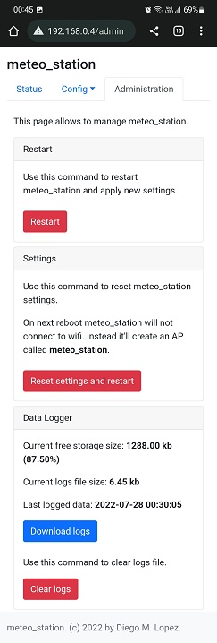

# About

Meteo station is an experimental weather measuring station built with ESP32.

It was developed using PaltformIO with Visual Studio Code.

In [this document](./doc/README.md) you'll find the electronic details to assemble this project.

# Features

Meteo station uses 2 sensors (DHT11 and BMP180) to measure temperature, atmospheric pressure and humidity.

It also connects to an MQTT server to publish those masures to different topics.

Topics list:
- `topic-meteo-temp`: temperature value from DHT11.
- `topic-meteo-temp2`: temperature value from BMP180.
- `topic-meteo-pres`: pressure value from BMP180.
- `topic-meteo-humi`: humidity value from DHT11.

Meteo station logs measures in the SPIFFS memory using LittleFS, in the file `/logs/meteo_data.txt` (defined in settings file).

Meteo station shows information in a 128x128 pixels display, in this format:


# Getting started

When meteo_station is running with an empty configuration, it'll not be able to connect to MQTT and date time services. To allow user to configure meteo_station, it creates a WiFi access point called `meteo_station`. You can connect to this WiFi network and access the next [link](http://192.168.4.1) to configure meteo_station.

After this, when meteo_station is running connected to a WiFi network and MQTT services, then you can configure it accessing to `http://meteo_station_ip_address/`.

 
# MQTT service

I choose [Hime MQ](https://www.hivemq.com/) MQTT service for testing porpuses. [Here](./doc/mqtt_ca_root.crt) you'll find the root ca certificate sor a secure connection to this service.

# MQTT monitoring

For monitoring porpuses I configured a complet IoT dashboard using [Iot MQTT Panel](https://play.google.com/store/apps/details?id=snr.lab.iotmqttpanel.prod) application for Android.

[Here](./doc/IoTMQTTPanel.json) is a JSON file to import in IoT MQTT Panel application to built the default dashboards.

 

# Configurating and managing using MQTT queues

Meteo station listens from the topic `topic-meteo-cmd` to receive different commands using the following json format:
```json
{
    "cmd": "command-type",
    "value": "some-value"
}
```

Theese are the available commands:
- `RESEND`: when this command is received (value fueld doesn't matters), the aplication will send current measures to MQTT topics.
- `GET_IP`: value field doesn't matters. The application will publish current local IP to topic `topic-meteo-res-ip`.
- `GET_LOG`: value field doesn't matters. The application will publish last successfully written log timestamp to topic `topic-meteo-res-log`, in format `yyyy-mm-dd hh:mm:ss`.
- `GET_LOG_SIZE`: value field doesn't matters. The application will publish current log file size to topic `topic-meteo-res-logsize`.
- `GET_STO_FREE`: value field doesn't matters. The application will publish current storage free size to topic `topic-meteo-res-freesto`.
- `SET_AP_SSID`: value field should be the ssid of the wifi AP to add to settings. The application will publish `OK` or `ERROR: message` to the topic `topic-meteo-res-ap-ssid`. SSID should not be empty nor currently present in settings-
- `SET_AP_PASS`: value field should be the password of the wifi AP to add to settings. The application will publish `OK` or `ERROR: message` to the topic `topic-meteo-res-ap-pass`. Password could be empty.
- `SET_AP_SAVE`: value field doesn't matters. The application will save the new wifi AP with given ssid and password using `SET_AP_SSID` and `SET_AP_PASS` commands, and publish `OK` or `ERROR: message` to the topic `topic-meteo-res-ap-save`.

# Configuration and management API Endpoints

Meteo station implements API endpoints to allow configuration and management, listening in port 80.

[Here](https://app.swaggerhub.com/apis-docs/LDiegoM/meteo_station/1.0.0) is the Open API Documentation.

# License

Meteo_station is an open source project by Diego M. Lopez that is licensed under [MIT](https://opensource.org/licenses/MIT). Diego M. Lopez reserves the right to change the license of future releases.

# Author

- Main idea, development and functional prototype by Diego M. Lopez (ldiegom@gmail.com)

# Changelog

## Unreleased

## 1.1.0 - 2022-08-27

- Fix MQTT reconnection using char* variable for certificate.
- Rename MqttHandlers class.
- Change HTTP Delete WiFi AP handler to receive ssid from URI.
- Add /measures endpoint to get current measures.
- Fix appendFile function to detect if file didn't chang.
- Update dependencies.
- Change MQTT connect method to send messages only on init.

## 1.0.0 - 2022-06-27

- Change storage to LittleFS, due to microSD is unstable.
- Add get free storage functionality and send to MQTT.
- Add capability to have empty settings.
- If no wifi available, starts AP to allow configuration.
- Add html and api handlers for WiFi settings.
- Allows to display measures in screen even if wifi is not connected.
- Add html and api handlers for MQTT settings.
- Add html and api handlers for Data Logger settings.
- Add html and api handlers for Date Time settings.
- Refactor html site to include status and administrative pages.
- Refactor Data Logger settings.
- Add html and api handlers for Administrative porpuses.
- Add html and api handlers for reading current status.
- Create display class for display logic abstraction.
- Add new display layout for mobile AP mode with no date time.
- Get bootstrap files from web when wifi is not in AP mode.
- Fix memory leak when reading file from LittleFS.

## 0.0.8 - 2022-05-10

- Add capability to get current log file size from MQTT.
- Remove ArduinoJson and DHT Sensor from stored libraries.
- Update dependencies and remove from stored libs
- Fix date-time configuration

## 0.0.6 - 2022-04-27

- Add http endpoints to download and delete meteo_logs and get settings.
- Log weather measures to SD card.
- Add data log monitoring command to MQTT subscriber.
- Add commands to return local IP and create new wifi AP.

## 0.0.3 - 2022-04-14

- Refactor mqtt and wifi abstractions.
- Add feature to create new wifi AP in settings and save it.

## 0.0.1 - 2022-04-11

- First code revision of the application.
