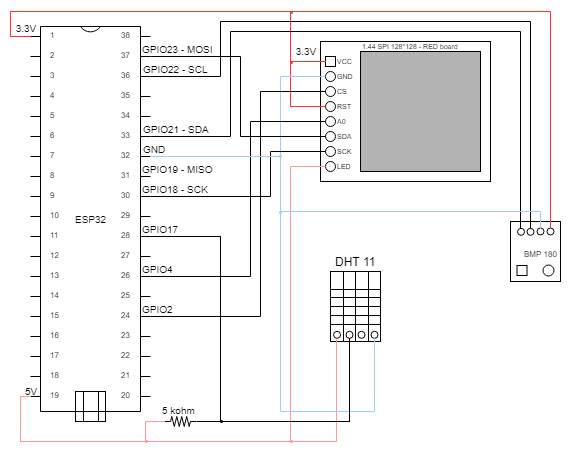

# Meteo station project details

This document describes the electronic construction of this project.

## Electronic componets

- 1x Esspresif ESP32.
- 1x color display 1.44' SPI 128x128 ILI9163.
- 1x DHT11 sensor.
- 1x BMP180 sensor.
- 1x microSD card adapter.
- 1x resistor 5k ohms.

## Electric diagram

## Prototype

For testing and viability purposes I built a full prototype that runs the Meteo station and offers a good user experience. The prototype follows exactly the connections of the Electric diagram.
